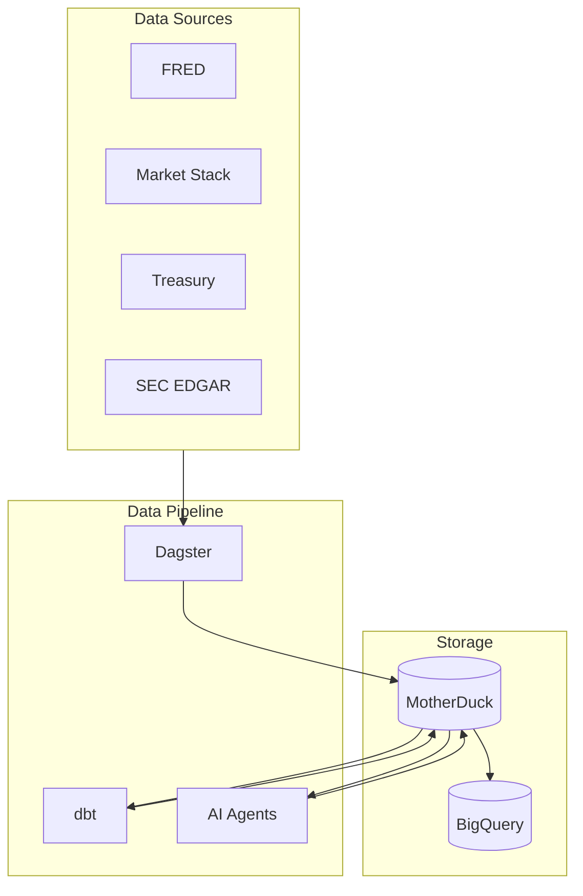

# Economic Data Platform Documentation

A data platform that ingests, transforms, and analyzes U.S. economic and financial market data. Data is queried conversationally over MCP — there is no REST API and no frontend.

## Quick Links

| Documentation | Description |
|--------------|-------------|
| [Data Platform Overview](./architecture/data-platform-overview.md) | High-level architecture |
| [Dagster Pipeline](./macro_agents/README.md) | Data orchestration documentation |
| [dbt Models](./dbt_project/README.md) | SQL transformation documentation |
| [dbt Platform + Fusion Onboarding](./dbt_project/dbt-platform-fusion-onboarding.md) | Issue #82 setup runbook |
| [GCP Deployment](./GCP_DEPLOYMENT_GUIDE.md) | Cloud deployment guide |

## System Architecture



## Module Documentation

| Module | Description | Documentation |
|--------|-------------|---------------|
| **macro_agents/** | Dagster data pipeline | [Dagster Docs](./macro_agents/README.md) |
| **dbt_project/** | SQL transformations | [dbt Docs](./dbt_project/README.md) |
| **scripts/** | Deployment and ops scripts | [Scripts Docs](./scripts/README.md) |

## Getting Started

### Prerequisites

- Python 3.11+
- Docker & Docker Compose
- MotherDuck account
- API keys for data sources (FRED, MarketStack, OpenAI/Anthropic)

### Quick Start

1. **Clone and configure**
   ```bash
   git clone https://github.com/C00ldudeNoonan/economic-data-project.git
   cd economic-data-project
   cp .env.example .env
   # Edit .env with your API keys
   ```

2. **Start Dagster**
   ```bash
   cd macro_agents
   uv sync --extra dev
   uv run dagster dev
   ```

   Or use Docker Compose for the full stack:
   ```bash
   docker compose up -d
   ```

## Data Pipeline

The pipeline runs on Dagster and processes data through:

1. **Ingestion** — fetch from external APIs (FRED, MarketStack, Treasury, SEC EDGAR, Reddit, Realtor.com)
2. **Transformation** — clean and model with dbt
3. **Analysis** — DSPy-based agents generate insights stored back in MotherDuck

## AI Analysis

DSPy-based agents handle:

- Economic cycle phase classification
- Cross-asset relationship analysis
- Portfolio recommendations
- Plain-English narratives

## Development

```bash
# Python tests
make test

# Python linting
make ruff

# SQL linting
make lint
```

## Deployment

- **Local**: `docker compose up -d`
- **Production (GCP)**: see the [GCP Deployment Guide](./GCP_DEPLOYMENT_GUIDE.md)

## Contributing

See [CONTRIBUTING.md](../CONTRIBUTING.md).
