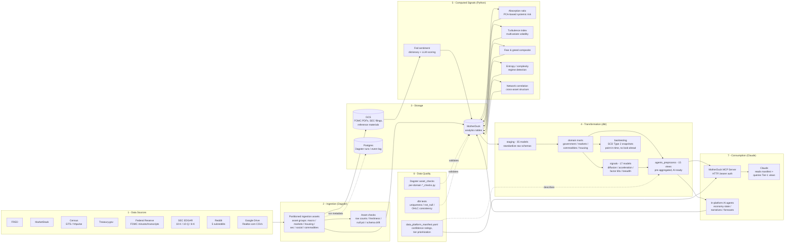

# Data Platform Architecture

A high-level map of how raw economic data becomes Claude-consumable insight.

## End-to-end diagram

---

## 1 — Data sources

| Source | Pulled via | Example assets |
|---|---|---|
| **FRED** | `FredResource` | `fred_raw`, `labor_market_series`, `inflation_series`, `interest_rates_series` |
| **MarketStack** | `MarketStackResource` | `sp500_companies_prices_raw`, `currency_etfs`, `major_indices_raw` |
| **Census** | direct HTTP | `housing_inventory_raw` (EITS), `housing_pulse_raw` (hhpulse) |
| **Treasury.gov** | XML scrape | `treasury_yields_raw` |
| **Federal Reserve** | `FederalReserveResource` | `fomc_minutes_raw`, `fomc_transcripts` (5y release lag) |
| **SEC EDGAR** | `SECEdgarResource` | `sec_company_cik`, `sec_filings`, filing-level chunked embeddings |
| **Reddit** | `RedditResource` | `reddit_posts_raw` partitioned by subreddit × date |
| **Google Drive** | `GoogleDriveResource` | Realtor.com housing CSVs (`realtor_raw`) |
| **Commodity APIs** | via MarketStack | `agriculture_commodities`, `energy_commodities`, `input_commodities` |

## 2 — Ingestion

Dagster assets, grouped by domain (`macro_ingestion`, `markets_ingestion`, `housing_ingestion`, `sec_ingestion`, `social_ingestion`, `computed_signals`, `fed_sentiment`, `data_infra`). Most are partitioned (date / ticker / subreddit) and run on staggered daily schedules. Ingestion writes raw rows to MotherDuck and unstructured artifacts (FOMC PDFs, SEC filings) to GCS.

## 3 — Storage

| Layer | Role |
|---|---|
| **MotherDuck** | Primary analytics store — raw, staged, and modeled tables |
| **GCS** | Unstructured artifacts: FOMC minutes PDFs, SEC filing HTML/Markdown, embedding chunks, reference materials |
| **Postgres** | Dagster run history and event log only (no business data) |
| **Local DuckDB** | Dev fallback when `ENVIRONMENT=dev` |

## 4 — Transformation (dbt)

| Layer | Count | Purpose |
|---|---|---|
| `staging/` | 35 | Type/unit/column normalization on raw ingest |
| `government/` | 8 | FRED diff/RoC, housing × population, mortgage rates |
| `markets/` | 13 | Split-adjusted prices, corporate actions, sector breadth |
| `commodities/` | 6 | Agriculture / energy / input commodity summaries |
| `signals/` | 17 | Cross-asset divergences, diffusion index, factor tilts |
| `analysis/` | 16+ | Regime classification, factor tilts, correlation analysis |
| `backtesting/` | 6 | SCD Type 2 snapshots — point-in-time correctness, prevents look-ahead |
| `agents_preprocess/` | 15 | Pre-aggregated views consumed by Claude / in-platform agents |
| `analytics/telemetry/` | 5 | Internal usage and performance metrics |

## 5 — Screening / signal capability

Cross-asset signals computed in Python Dagster assets, then materialized back to MotherDuck:

| Signal | Method | Output |
|---|---|---|
| **Absorption ratio** | PCA on S&P 500 returns (Kritzman 2011) | Systemic-risk fragility flag |
| **Turbulence index** | Multivariate volatility (equity / commodity / FX) | Market-stress regime |
| **Fear & greed composite** | VIX, put/call, breadth, junk spreads, safe-haven flows | Sentiment score |
| **Entropy / complexity** | Returns autocorrelation + entropy | Regime stability |
| **Network correlation** | Rolling correlation matrix across asset classes | Regime-shift detection |
| **Fed sentiment** | Dictionary + LLM scoring on FOMC text | Hawkish / dovish trajectory |

dbt-native screens (`signals/`) cover diffusion / breadth, economic acceleration, factor tilts, financial conditions, inflation, labor, housing, and liquidity.

## 6 — Data quality layer

Three reinforcing tiers:

1. **Dagster asset checks** (`*_checks.py` per domain) — row counts, freshness, null %, schema-drift bounds. These run alongside the asset and gate downstream materialization.
2. **dbt tests** — uniqueness, not_null, accepted_values, OHLC consistency, forward-returns sanity. Coverage: 81% of 130 models tested; 100% on signals / commodities / markets.
3. **`scripts/data_platform_manifest.yaml`** — declares per-table confidence ratings, test coverage, and tier-1 priority for AI consumption. This is what Claude reads to decide which view to query.

## 7 — Consumption layer (Claude)

Claude is the front door. Two access paths:

- **MotherDuck MCP server** (configured in `.mcp.json`) — Claude lists tables, reads schemas, and runs queries directly against MotherDuck over HTTP with bearer auth.
- **`data_platform_manifest.yaml`** — orientation map: tier-1 views (`agent_market_performance`, `agent_commodity_performance`, `agent_fred_series_latest_aggregates`, `agent_financial_conditions_index`, `agent_housing_inventory_latest_aggregates`, `agent_treasury_yield_curve_spreads`, `agent_leading_econ_return_indicator`), time-period templates, and signal severity thresholds.

In-platform AI agents (`analyze_economy_state`, `generate_economic_narratives`, `generate_indicator_forecasts`, `score_fed_sentiment_llm`) run inside Dagster and write their outputs back to MotherDuck, where Claude can reach them through the same MCP path.

The platform deliberately has **no REST API and no frontend** — querying is conversational, mediated by Claude over MCP.
