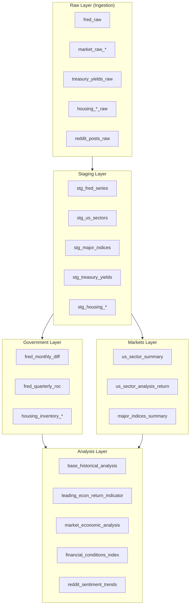
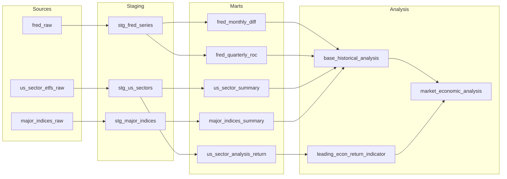

# dbt Project Documentation

The `dbt_project/` module contains SQL-based data transformations that process raw data into analytical models.

## Architecture



## Directory Structure

```
dbt_project/
├── dbt_project.yml        # Project configuration
├── profiles.yml           # Database connection profiles
├── packages.yml           # dbt packages
├── models/
│   ├── staging/           # Layer 1: Clean raw data
│   │   ├── stg_fred_series.sql
│   │   ├── stg_us_sectors.sql
│   │   ├── stg_major_indices.sql
│   │   ├── stg_treasury_yields.sql
│   │   └── stg_housing_*.sql
│   ├── government/        # Layer 2: Economic indicators
│   │   ├── fred_monthly_diff.sql
│   │   ├── fred_quarterly_roc.sql
│   │   └── housing_*.sql
│   ├── markets/           # Layer 2: Market analysis
│   │   ├── us_sector_summary.sql
│   │   ├── us_sector_analysis_return.sql
│   │   ├── major_indices_summary.sql
│   │   └── commodities_*.sql
│   ├── analysis/          # Layer 3: Cross-domain
│   │   ├── base_historical_analysis.sql
│   │   ├── leading_econ_return_indicator.sql
│   │   ├── market_economic_analysis.sql
│   │   ├── financial_conditions_index.sql
│   │   └── reddit_sentiment_trends.sql
│   └── backtesting/       # Historical snapshots
│       └── snapshot_*.sql
├── macros/                # Reusable SQL macros
├── tests/                 # Data tests
└── seeds/                 # Static data files
```

## Model Layers

### Layer 1: Staging

Purpose: Clean and standardize raw data

| Model | Source | Description |
|-------|--------|-------------|
| `stg_fred_series` | `fred_raw` | Standardized FRED time series |
| `stg_us_sectors` | `us_sector_etfs_raw` | Clean sector ETF prices |
| `stg_major_indices` | `major_indices_raw` | Clean market index prices |
| `stg_treasury_yields` | `treasury_yields_raw` | Clean treasury yields |
| `stg_housing_inventory` | `housing_inventory_raw` | Clean housing data |

### Layer 2: Government

Purpose: Economic indicator aggregations

| Model | Description |
|-------|-------------|
| `fred_monthly_diff` | Month-over-month value changes |
| `fred_quarterly_roc` | Quarter-over-quarter rate of change |
| `housing_inventory_latest_aggregates` | Latest housing metrics by region |

### Layer 2: Markets

Purpose: Market performance analysis

| Model | Description |
|-------|-------------|
| `us_sector_summary` | Sector performance statistics |
| `us_sector_analysis_return` | Sector forward returns (Q1, Q2, Q3) |
| `major_indices_summary` | Index performance statistics |
| `commodities_summary` | Commodity performance metrics |

### Layer 3: Analysis

Purpose: Cross-domain analytics

| Model | Description |
|-------|-------------|
| `base_historical_analysis` | Combined economic + market data |
| `leading_econ_return_indicator` | Economic indicators vs future returns |
| `market_economic_analysis` | Correlation analysis |
| `financial_conditions_index` | Composite financial conditions |
| `reddit_sentiment_trends` | Social sentiment over time |

## Model Lineage



## Configuration

### dbt_project.yml

```yaml
name: 'econ_database'
version: '1.0.0'
config-version: 2

profile: 'econ_database'

model-paths: ["models"]
analysis-paths: ["analyses"]
test-paths: ["tests"]
seed-paths: ["seeds"]
macro-paths: ["macros"]

target-path: "target"
clean-targets:
  - "target"
  - "dbt_packages"

models:
  econ_database:
    staging:
      +materialized: table
    government:
      +materialized: table
    markets:
      +materialized: table
    analysis:
      +materialized: table
```

### profiles.yml

```yaml
econ_database:
  outputs:
    dev:
      type: duckdb
      path: '../local.duckdb'
      schema: main

    prod:
      type: duckdb
      path: 'md:economic_data?motherduck_token={{ env_var("MOTHERDUCK_TOKEN") }}'
      schema: main

  target: "{{ env_var('DBT_TARGET', 'dev') }}"
```

## Running dbt

### Install Dependencies

```bash
cd dbt_project
dbt deps
```

### Run Models

```bash
# Run all models
dbt run

# Run specific model
dbt run --select stg_fred_series

# Run models in a layer
dbt run --select staging.*

# Run models and downstream
dbt run --select stg_fred_series+
```

### Test Models

```bash
# Run all tests
dbt test

# Test specific model
dbt test --select stg_fred_series
```

### Generate Documentation

```bash
dbt docs generate
dbt docs serve
```

## Integration with Dagster

dbt models are executed as Dagster assets via `dagster-dbt`:

```python
from dagster_dbt import DbtCliResource, dbt_assets

@dbt_assets(
    manifest=dbt_manifest_path,
    dagster_dbt_translator=CustomDbtTranslator(),
)
def dbt_project_assets(context, dbt: DbtCliResource):
    yield from dbt.cli(["build"], context=context).stream()
```

Assets are grouped and can be run:
- Individually via Dagster UI
- As part of scheduled jobs
- Triggered by upstream asset materialization

## Data Quality

### Schema Tests

```yaml
# models/staging/schema.yml
models:
  - name: stg_fred_series
    columns:
      - name: series_id
        tests:
          - not_null
          - unique
      - name: date
        tests:
          - not_null
      - name: value
        tests:
          - not_null
```

### Custom Tests

```sql
-- tests/assert_positive_values.sql
SELECT *
FROM {{ ref('stg_fred_series') }}
WHERE value < 0
  AND series_id IN ('UNRATE', 'GDP')
```
