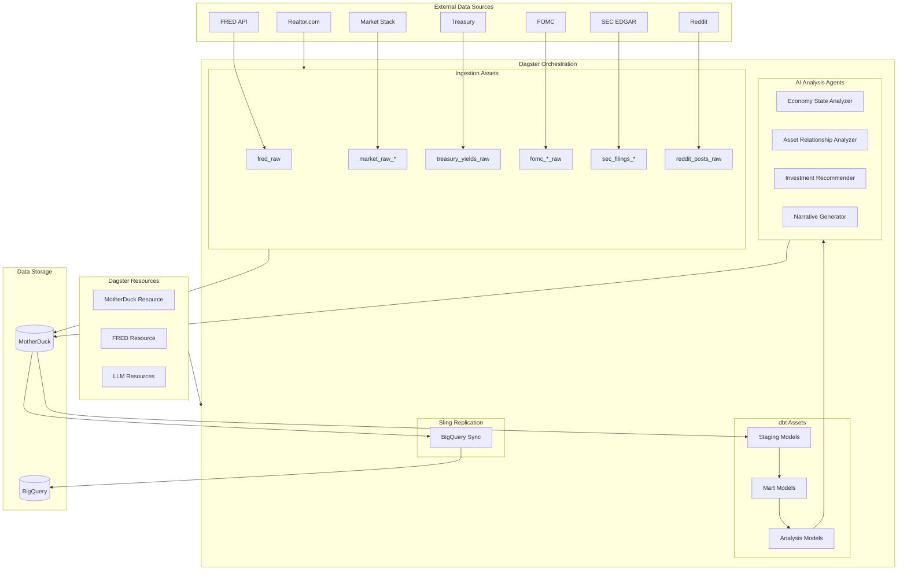
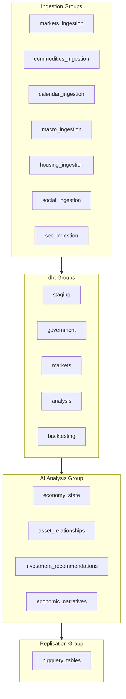

# Dagster Pipeline Documentation

The `macro_agents/` module contains the Dagster-based data orchestration pipeline that ingests, transforms, and analyzes economic and market data.

## Architecture



## Directory Structure

```
macro_agents/
├── src/macro_agents/
│   ├── definitions.py         # Dagster definitions entry point
│   └── defs/
│       ├── domains/           # Domain assets + automation
│       │   ├── markets.py     # ETFs, indices, commodities, company prices
│       │   ├── calendars.py   # Economic + earnings calendars
│       │   ├── macro.py       # FRED + Treasury + FOMC minutes
│       │   ├── housing.py     # Realtor housing data
│       │   ├── social.py      # Reddit ingestion
│       │   ├── sec.py         # SEC filings
│       │   └── fomc_transcripts.py
│       ├── agents/            # AI analysis assets
│       │   ├── economy_state_analyzer.py
│       │   ├── asset_class_relationship_analyzer.py
│       │   ├── investment_recommendations.py
│       │   ├── economic_narrative_assets.py
│       │   ├── news_summary_assets.py
│       │   ├── domain_sub_agents.py
│       │   └── backtest_*.py  # Backtesting agents
│       ├── sensors/           # Event-driven trigger exports
│       │   └── __init__.py
│       ├── resources/         # External connections
│       │   ├── motherduck.py
│       │   ├── fred.py
│       │   ├── market_stack.py
│       │   ├── gcs.py
│       │   └── ...
│       ├── replication/       # BigQuery sync
│       │   └── sling.py
│       ├── transformation/    # Custom transformations
│       │   └── financial_condition_index.py
│       ├── telemetry/         # Monitoring
│       ├── shared_resources.py # Shared resources
│       └── asset_failure_sensor.py
├── tests/
├── pyproject.toml
└── dagster.yaml
```

## Asset Groups



## Key Assets

### Ingestion Assets

| Asset | Source | Schedule | Partitions |
|-------|--------|----------|------------|
| `fred_raw` | FRED API | Weekly | 70+ series codes |
| `us_sector_etfs_raw` | Market Stack | Weekly | Ticker + Month |
| `major_indices_raw` | Market Stack | Weekly | Ticker + Month |
| `treasury_yields_raw` | Treasury | Weekly (Sunday) | Year |
| `fomc_minutes_raw` | Federal Reserve | Daily | Document |
| `sec_filing_metadata` | SEC EDGAR | On-demand | Company CIK |
| `reddit_posts_raw` | Reddit API | Daily | Date + Subreddit |

### AI Analysis Assets

| Asset | Input | Output | LLM |
|-------|-------|--------|-----|
| `analyze_economy_state` | Economic indicators | Cycle classification | GPT-4/Gemini |
| `analyze_asset_class_relationships` | Market correlations | Relationship insights | GPT-4/Gemini |
| `generate_investment_recommendations` | Economy + Markets | Portfolio allocations | GPT-4/Gemini |
| `generate_economic_narratives` | All data | Plain-English summaries | GPT-4/Gemini |

## Resources

### MotherDuck Resource

```python
motherduck_resource = MotherDuckResource(
    environment="prod",  # or "dev" for local DuckDB
    md_token=os.getenv("MOTHERDUCK_TOKEN"),
    md_database="economic_data",
    md_schema="main",
)
```

### LLM Resources

Multiple LLM providers are supported:
- OpenAI (GPT-4, GPT-3.5)
- Anthropic (Claude)
- Google (Gemini)

```python
economic_analysis_resource = EconomicAnalysisResource(
    model_provider="gemini",
    model_name="gemini-3-pro-preview",
)
```

## Sensors

| Sensor | Trigger | Action |
|--------|---------|--------|
| `treasury_yields_ingestion_schedule` | Weekly (Sunday) | Run treasury yields ingestion |
| `realtor_gdrive_file_monitor` | Every minute | Trigger Realtor ingestion for updated files |

## Jobs

| Job | Description |
|-----|-------------|
| `dbt_models_job` | Run all dbt transformations |
| `weekly_economic_analysis_job_*` | Weekly AI analysis (by personality) |
| `backtesting_job` | Historical strategy testing |
| `weekly_replication_job` | BigQuery sync |

## Running Dagster

### Development

```bash
cd macro_agents
dagster dev
```

Access the UI at http://localhost:3000

### Production

Deploy to Dagster Cloud or use Docker:

```bash
docker-compose up -d
```

## Configuration

### Environment Variables

| Variable | Description |
|----------|-------------|
| `ENVIRONMENT` | dev/staging/prod |
| `MOTHERDUCK_TOKEN` | MotherDuck authentication |
| `FRED_API_KEY` | FRED API key |
| `MARKETSTACK_API_KEY` | Market Stack API key |
| `OPENAI_API_KEY` | OpenAI API key |
| `ANTHROPIC_API_KEY` | Anthropic API key |
| `GEMINI_API_KEY` | Google Gemini API key |
| `GOOGLE_APPLICATION_CREDENTIALS` | GCP service account path |

### dagster.yaml

```yaml
run_coordinator:
  module: dagster.core.run_coordinator
  class: QueuedRunCoordinator

run_launcher:
  module: dagster.core.launcher
  class: DefaultRunLauncher

storage:
  postgres:
    postgres_url:
      env: DAGSTER_POSTGRES_URL
```
